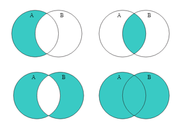
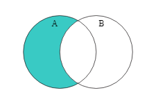
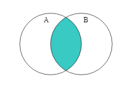
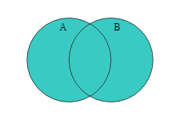
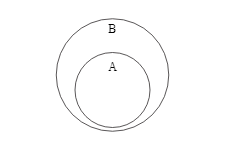
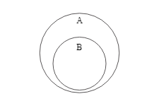
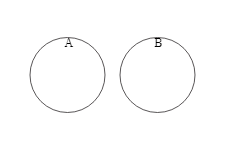
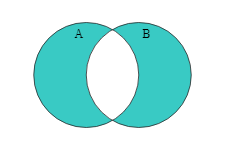

# ProposalSet



## Install

```bash
npm install proposal-set
```

## Description

An expanded javascript and typescript set that has all current set proposals with type information and
intellisense explanations. Works in node and in the browser. Stop reinventing the wheel
and start using extremely elegant, concise, and performant set operations. As a shim it will test if there's
a native implementation and use that first—so this package won't become an issue in the future. 

The underlying shim ([es-shims](https://github.com/es-shims)) is robust and well tested but doesn't
have everything grouped together in one place. 


## Use

```typescript
import pSet from "proposal-set";

const x = new pSet([1, 2, 3]);
const y = new pSet([1, 2]);

console.log(x.difference(y));
// => Set(1) { 3 }

console.log(x.intersection(y));
// => Set(2) { 1, 2 }

console.log(x.union(y));
// => Set(3) { 1, 2, 3 }
```

## Further Information

This packages implements the following proposed Set methods using shims provided by
[es-shims](https://github.com/es-shims), including:


### Set.difference 

[MDN Web Docs: Set.difference](https://developer.mozilla.org/en-US/docs/Web/JavaScript/Reference/Global_Objects/Set/difference)

Everything in A that's not in B:



### Set.intersection

[MDN Web Docs: Set.intersection](https://developer.mozilla.org/en-US/docs/Web/JavaScript/Reference/Global_Objects/Set/intersection)

Items that are common between A and B.



### Set.union

[MDN Web Docs: Set.union](https://developer.mozilla.org/en-US/docs/Web/JavaScript/Reference/Global_Objects/Set/union)

Combination of A and B




### Set.isSubsetOf

[MDN Web Docs: Set.isSubsetOf](https://developer.mozilla.org/en-US/docs/Web/JavaScript/Reference/Global_Objects/Set/isSubsetOf)

Is everything in A also in B?



### Set.isSupersetOf

[MDN Web Docs: Set.isSupersetOf](https://developer.mozilla.org/en-US/docs/Web/JavaScript/Reference/Global_Objects/Set/isSupersetOf)

Does A contain everything in B?



### Set.isDisjointFrom

[MDN Web Docs: Set.isDisjointFrom](https://developer.mozilla.org/en-US/docs/Web/JavaScript/Reference/Global_Objects/Set/isDisjointFrom)

Are there no common elements between the two sets?



### Set.symmetricDifference

[MDN Web Docs: Set.symmetricDifference](https://developer.mozilla.org/en-US/docs/Web/JavaScript/Reference/Global_Objects/Set/symmetricDifference)

The opposite of an intersection. A new set containing everything unique to A and B in one set.


